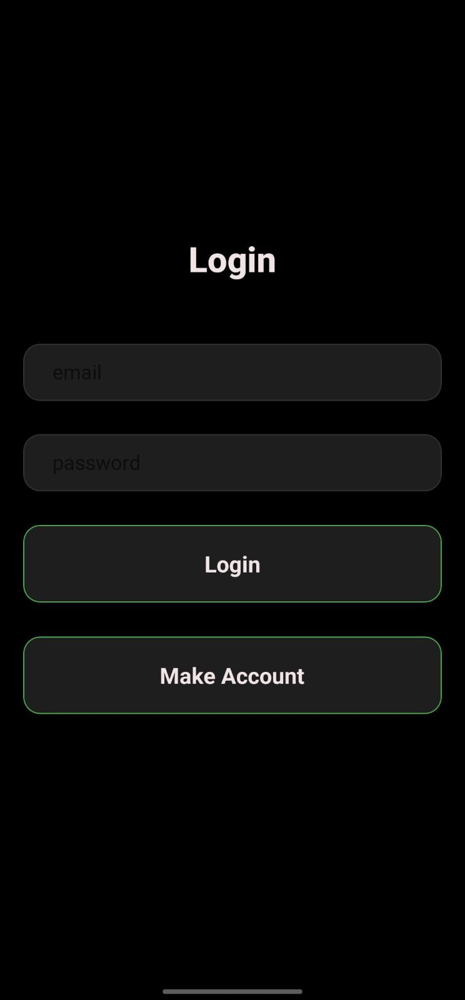
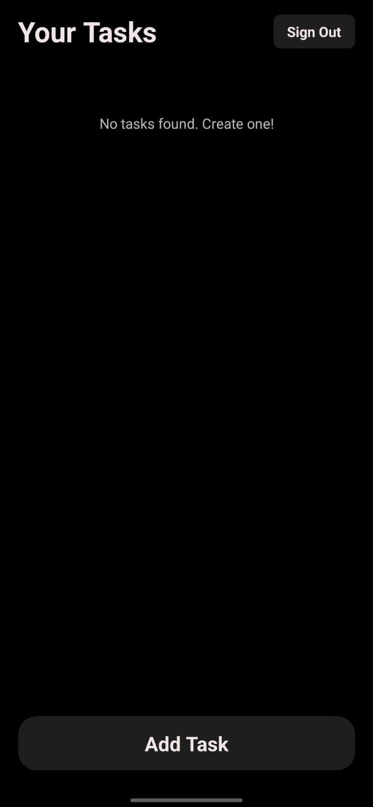
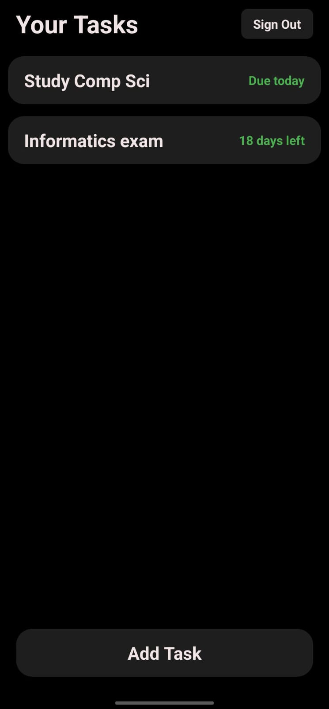
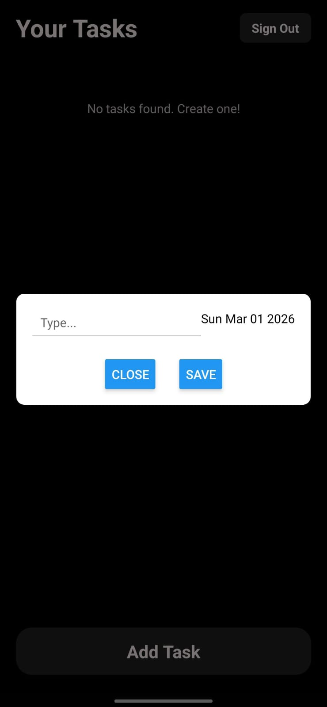
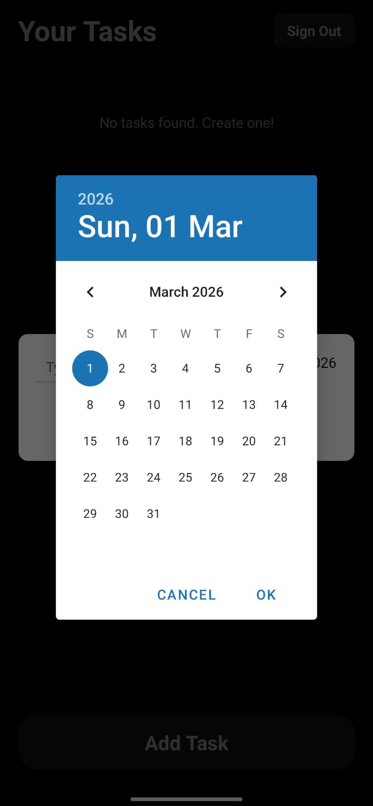
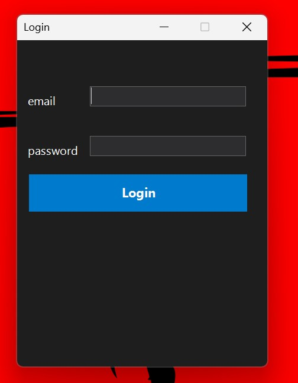
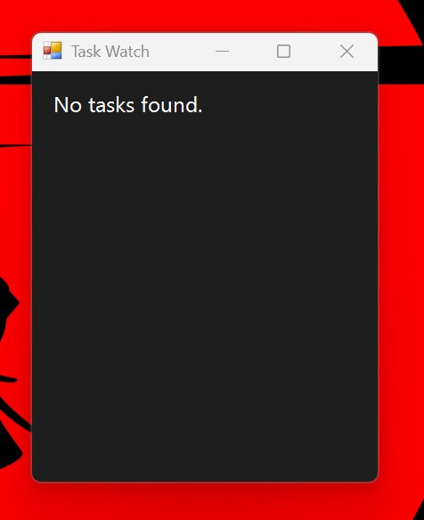
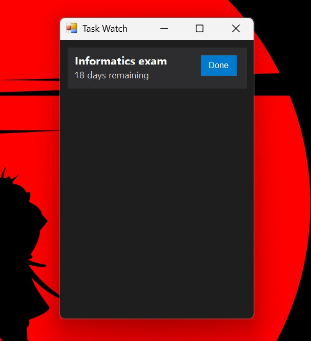
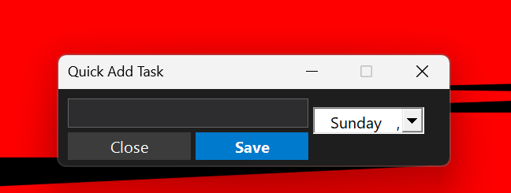
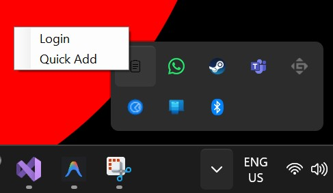

# TaskWatch ⏱️

TaskWatch is a sleek, cross-platform personal task manager designed to keep you productive across all your devices. Built with Expo and Firebase, it offers real-time syncing and a seamless user experience.

---

## 📱 Mobile App

Manage your tasks on the go with our intuitive mobile interface.

### Screenshots

<div align="center">
  
  
  
  
  
</div>

---

## 🖥️ Desktop Tray Counterpart

TaskWatch isn't just for your phone. It includes a dedicated **Desktop Tray Counterpart** that lives in your system tray, ensuring your tasks are always just a click away.

- **Real-time Syncing**: Tasks added on mobile appear instantly on desktop, and vice versa.
- **Micro-interactions**: Quick-add and quick-view features designed for minimal disruption.

### Screenshots

<div align="center">
  
  
  <br/>
  
  
  <br/>
  
</div>

---

## 🚀 Getting Started

### 1. Prerequisites
- [Node.js](https://nodejs.org/) (Latest LTS)
- [Expo Go](https://expo.dev/go) app on your mobile device (for development)

### 2. Setup
1. Clone the repository.
2. Install dependencies:
   ```bash
   npm install
   ```
3. Configure Environment Variables:
   - Copy `.env.example` to `.env`.
   - Fill in your Firebase configuration keys in `.env`.

### 3. Run the App
```bash
npx expo start
```
Scan the QR code with your Expo Go app or use an emulator.

---

## 🛠️ Tech Stack
- **Frontend**: React Native, Expo, Expo Router
- **Backend**: Firebase (Auth, Firestore)
- **Styling**: Vanilla CSS / React Native Styles
